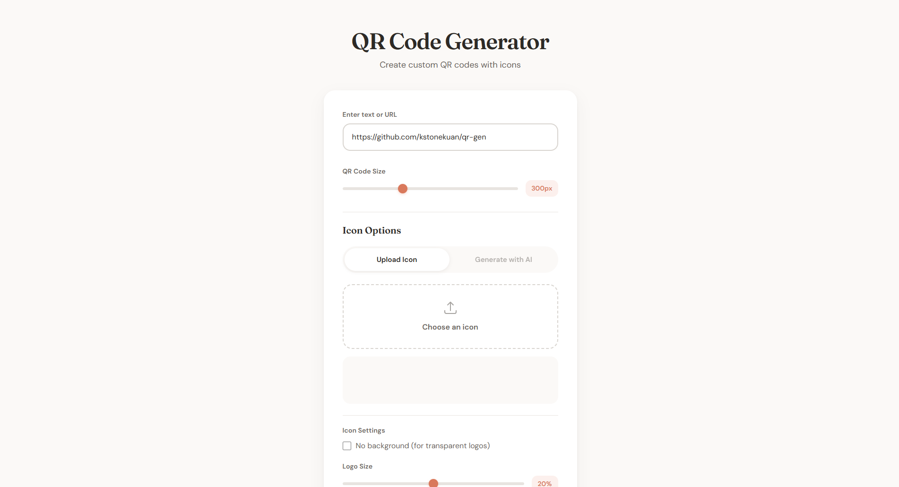

# QR Code Generator with AI Icons



A modern, open-source QR code generator built with TypeScript and Tailwind CSS. Create custom QR codes with uploaded icons or AI-generated icons using Google's Gemini API.

## Features

- **QR Code Generation**: Create QR codes for any text or URL
- **Custom Icons**: Upload your own icon to place in the center of the QR code
- **AI Icon Generation**: Generate icons using natural language descriptions via Gemini 2.5 Flash
- **Customizable System Prompt**: Edit the AI prompt directly in the UI for custom icon generation behavior
- **QR Code Validation**: Automatically validates QR codes remain scannable after adding icons using jsQR
- **Icon Settings**:
  - Adjustable icon size (5-40% of QR code)
  - Optional white border (0-10px) for better contrast
  - Transparent background support for PNG logos
- **Keyboard Shortcuts**: Press Enter to generate icons or QR codes
- **Rate Limiting**: Built-in rate limiting (60 requests per hour) for API usage
- **Modern Tech Stack**: Built with TypeScript, Tailwind CSS, and Vite
- **Responsive Design**: Works seamlessly on desktop and mobile devices
- **Privacy-First**: API keys are stored locally in your browser
- **No Backend Required**: Runs entirely in the browser, perfect for GitHub Pages

## Live Demo

Visit the live demo at: [https://kstonekuan.github.io/qr-gen](https://kstonekuan.github.io/qr-gen)

## Quick Start

### Development

1. Clone this repository:
```bash
git clone https://github.com/kstonekuan/qr-gen.git
cd qr-gen
```

2. Install dependencies:
```bash
pnpm install
```

3. Start the development server:
```bash
pnpm dev
```

4. To use AI icon generation:
   - Get a free API key from [Google AI Studio](https://aistudio.google.com/apikey)
   - Enter the key in the app's Gemini API Settings section (stored in localStorage)

### Production Build

```bash
pnpm build
```

The built files will be in the `dist` directory.

## Deployment on GitHub Pages

This project uses GitHub Actions for automatic deployment:

1. Push your changes to the `main` branch
2. GitHub Actions will automatically build and deploy to GitHub Pages

To set up GitHub Pages:
1. Go to Settings → Pages
2. Under "Source", select "Deploy from a branch"
3. Choose "gh-pages" branch and "/" (root) folder
4. Save the settings

## Usage

### Creating a Basic QR Code

1. Enter your text or URL in the input field
2. Adjust the size using the slider (200-500px)
3. Click "Generate QR Code"
4. Download your QR code using the download button

### Adding a Custom Icon

#### Upload Method:
1. Click the "Upload Icon" tab
2. Choose an image file from your device
3. Adjust logo size (15-25% recommended for best scanning)
4. Optionally enable transparent background for PNG logos
5. Optionally adjust border size (0-10px) for better contrast
6. Generate your QR code - the icon will be automatically centered

#### AI Generation Method:
1. Click the "Generate with AI" tab
2. Enter your Gemini API key (one-time setup)
3. Describe the icon you want (e.g., "shopping cart", "email envelope")
4. Click "Generate Icon"
5. Generate your QR code with the AI-created icon

## Technical Details

### Built With

- **TypeScript**: Type-safe development
- **Tailwind CSS**: Utility-first CSS framework
- **Vite**: Fast build tool and dev server
- **QRCode**: For QR code generation
- **Google GenAI SDK**: Official Google AI SDK for icon generation
- **jsQR**: For QR code validation
- **HTML5 Canvas**: For QR code rendering and icon overlay

### API Rate Limiting

The application includes built-in rate limiting for Gemini API calls:
- 60 requests per hour per browser
- Rate limit resets on a rolling window
- Remaining requests are displayed when low
- All tracking is done locally

### Browser Support

- Chrome/Edge 90+
- Firefox 88+
- Safari 14+
- Mobile browsers (iOS Safari, Chrome Mobile)

## Contributing

Contributions are welcome! Please feel free to submit a Pull Request. For major changes, please open an issue first to discuss what you would like to change.

### Development Scripts

```bash
pnpm run dev        # Start development server
pnpm run build      # Build for production
pnpm run preview    # Preview production build
pnpm run typecheck  # Run TypeScript type checking
pnpm run lint       # Run Biome linter
pnpm run format     # Format code with Biome
```

## License

This project is licensed under the MIT License - see the [LICENSE](LICENSE) file for details.

## Acknowledgments

- [qrcode](https://github.com/soldair/node-qrcode) for QR code generation
- [Google Gemini](https://deepmind.google/technologies/gemini/) for AI capabilities
- [jsQR](https://github.com/cozmo/jsQR) for QR code validation
- [Tailwind CSS](https://tailwindcss.com/) for styling
- [Vite](https://vitejs.dev/) for build tooling

## Privacy

- All data processing happens in your browser
- API keys are stored locally using localStorage
- No analytics or tracking
- No external requests except to Gemini API (when using AI features)

## Troubleshooting

**QR Code not generating?**
- Ensure you've entered text or a URL
- Check browser console for errors

**AI Icon generation failing?**
- Verify your API key is correct
- Check if you've hit the rate limit
- Ensure you have internet connection

**Icon not appearing in QR code?**
- Try a smaller icon or different format
- Ensure the image loads correctly in preview

**QR code validation warning?**
- Reduce the icon size percentage
- Enable the white border for better contrast
- Some complex QR codes may be harder to validate